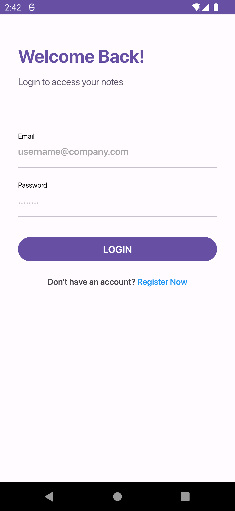
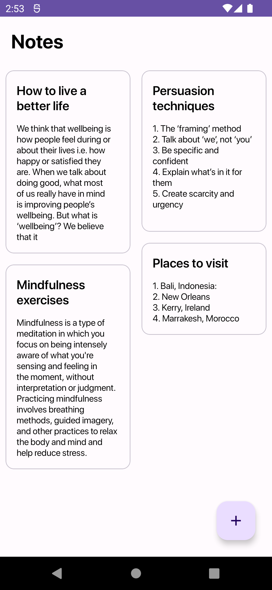
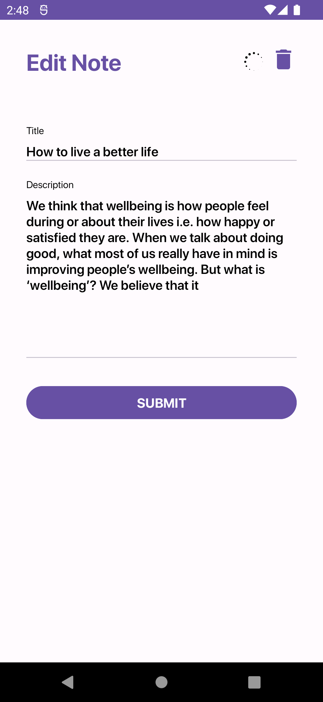

# My Notes

A simple note taking android app build in kotlin. It uses retrofit as REST Client, follows android
mvvm
architecture for data flow and single activity architecture for UI. For accessing authenticated
ends, [JSON Web Token](https://jwt.io/introduction)
is used.

## Features

1. Users can login or signup.
2. Users can create, update and delete their notes.

## Screenshots

|                                             |                                               |                                                  |
|---------------------------------------------|-----------------------------------------------|--------------------------------------------------|
|  |  |  |

## Build with

[Kotlin](https://kotlinlang.org/): As the programming language.  
[Retrofit](https://square.github.io/retrofit/): As the rest client.  
[Gson](https://github.com/google/gson): To parse json into model classes.  
[Datastore](https://developer.android.com/topic/libraries/architecture/datastore): To store auth
token.  
[Hilt](https://developer.android.com/training/dependency-injection/hilt-android): To inject
dependencies.  
[Navigation Component](https://developer.android.com/guide/navigation): To navigate between
navigation.  
[Kotlin Flow](https://developer.android.com/kotlin/flow): To fetch data asynchronously.  
[Kotlin Coroutines](https://developer.android.com/kotlin/coroutines): For asynchronous
programming.  
[Android-SpinKit](https://github.com/ybq/Android-SpinKit): For loading animation.

## Architecture

1. MVVM Architecture.
2. Repository pattern.
3. Single Activity Architecture

## More Info

This is the client side application. The REST API for this app is build
using [ktor framework](https://ktor.io/)
which you can find [here](https://github.com/sDevPrem/ktor-notes-api).